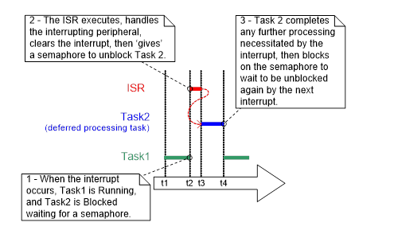
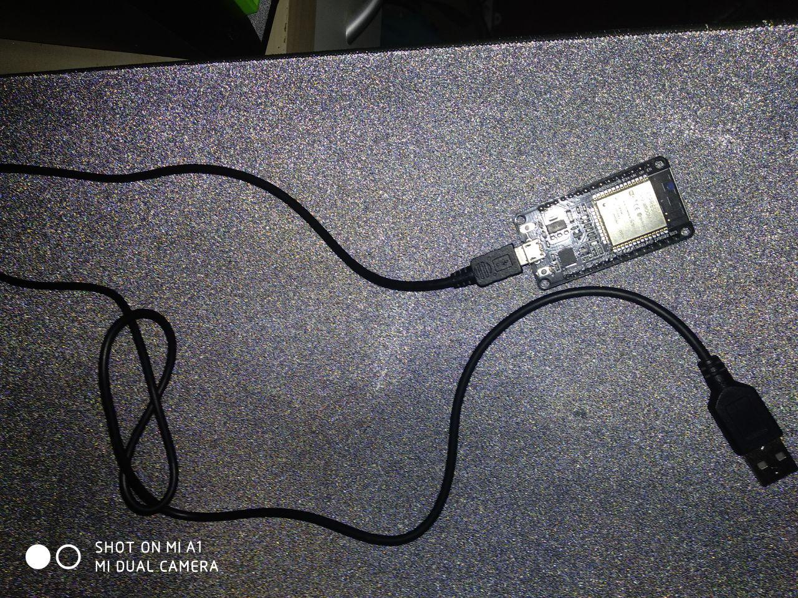
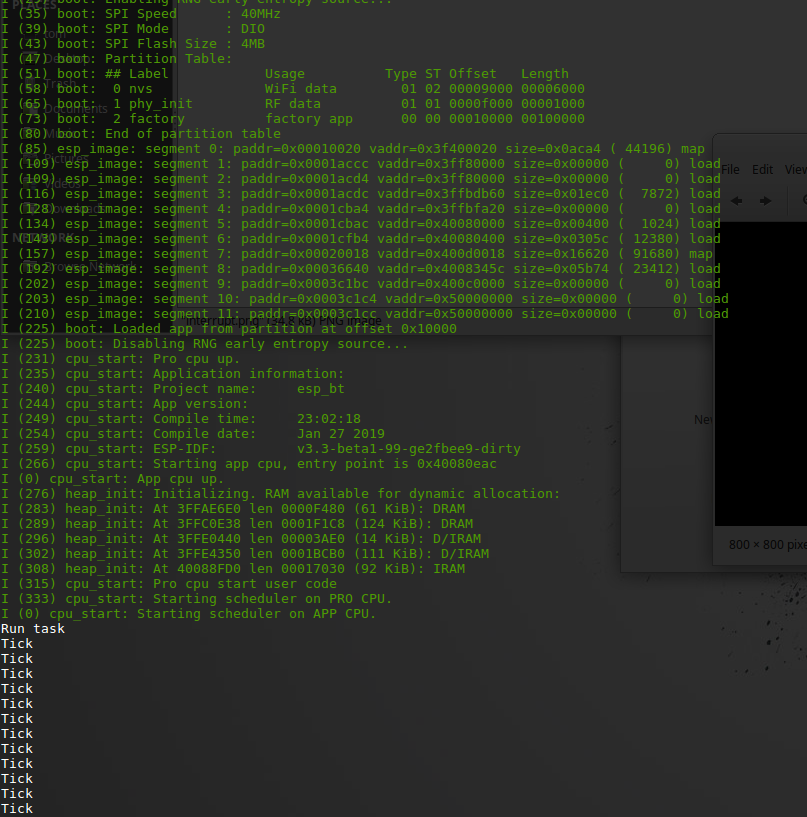

# Manage interrupt with Freertos

Brief example on how to use a one second interrupt to print "tick" on my ESP32-WROOM (esp-idf), running Freertos OS. This is done to learn to manage more task on the Freertos OS.

 
 

 From the official documentation:  
 https://docs.aws.amazon.com/freertos-kernel/latest/dg/interrupt-management.html

 Thi is the ESP32-WROOM. Esp-idf documentation  official page: 
 https://docs.espressif.com/projects/esp-idf/en/latest/api-reference/

  Link to buy the hardware:  
  https://www.amazon.it/s/ref=nb_sb_noss_1?__mk_it_IT=%C3%85M%C3%85%C5%BD%C3%95%C3%91&url=search-alias%3Daps&field-keywords=esp32

Result readed on USB channel using picocom, open Terminal and press:

`sudo picocom -b 115200 /dev/ttyUSB0`

  